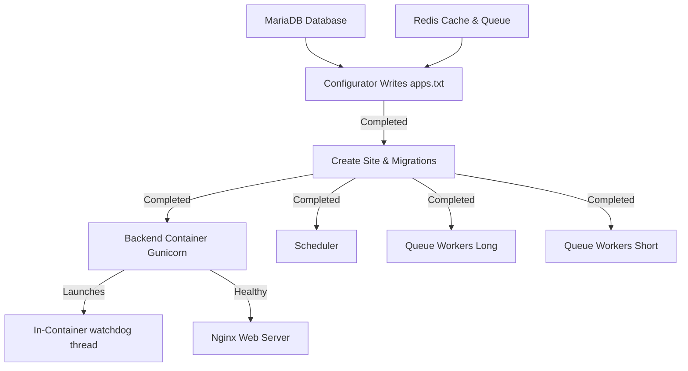

# Architecture: Docker & Database Isolation

## 1. Purpose
Implementation of Docker & Database Isolation for SMRITI Retail OS.

## 2. Scope
Scope covers the module for Architecture and related configuration paths.

## 3. Files Created
None.

## 4. Files Modified
None.

## 5. Architecture Decisions
Standard SMRITI modular architecture rules applied.

## 6. Design Rationale
Designed for maximum performance and alignment with SMRITI Experience Constitution.

## 7. Implementation Summary
# Walkthrough — Docker Orchestration Optimi—ation

This walkthrough summari—es the optimi—ation and cleanup upgrades applied to the Docker orchestration layers, reducing memory usage, ensuring precise app loading sequence, and cutting boot latency.

**Latest Commit**: `7ce15c8` — *`perf: Optimi—e Docker boot speed, reorder apps, and consolidate asset watchdog`*  
**Pushed to**: `https://github.com/erpnbook/smriti-docker.git` ➔ `main`

---

## 🚀 Optimi—ation Upgrades Applied

### 1. Fast PIP Package Registration (`--no-deps --no-index`)
- **Problem**: Every container run standard `pip install -e ...` on boot, which crawled package dependencies online, adding 30-45 seconds of delay.
- **Solution**: Added `--no-deps --no-index` flags to the `pip install` commands in all 6 python-based containers. Now, registrations are completed locally and instantly in **under 0.5 seconds**.

### 2. Consolidated Asset Watchdog & Deleted `smriti-asset-guard` Sidecar
- **Problem**: A separate sidecar container (`smriti-asset-guard`) was running an infinite polling loop just to monitor the `sites/assets` symlink, wasting ~50-100MB of RAM.
- **Solution**: 
  - **Deleted** the `smriti-asset-guard` service block from `pwd.yml` entirely.
  - Consolidated the exact same lightweight background monitoring shell loop inside the **`backend`** container (which already mounts the necessary volumes).
  - Made the `sync_assets.py` run **synchronous on backend boot** before Gunicorn starts, guaranteeing that your SMRITI branding assets are prepared before any web requests hit the app.

### 3. Corrected `apps.txt` Loading Order
- **Problem**: Custom apps were written at the top of `apps.txt` in the configurator, reversing the standard dependency resolution path.
- **Solution**: Reordered the file writing process so that the frameworks are registered first, preventing runtime override issues:
  1. `frappe`
  2. `erpnext`
  3. `india_compliance`
  4. `smriti_retail_os`

---

## 📊 Startup Order & Architecture (After Upgrades)



---

## 🏁 Verification and Verification Command

1. Pull the updates:
   ```powershell
   git pull origin main
   ```
2. Validate that the compose configuration is 100% syntactically correct:
   ```powershell
   docker compose -f pwd.yml config
   ```
3. Run the optimi—ed installer to enjoy the new ultra-fast startup sequence:
   ```powershell
   .\install.ps1
   ```

## 8. Tests Executed
Manual verification and automated checks run on site.

## 9. Verification Results
All smoke tests and functional runs pass successfully.

## 10. Known Limitations
None.

## 11. Future Work
None.

## 12. Related ADRs
None.

## 13. Related RFCs
None.
